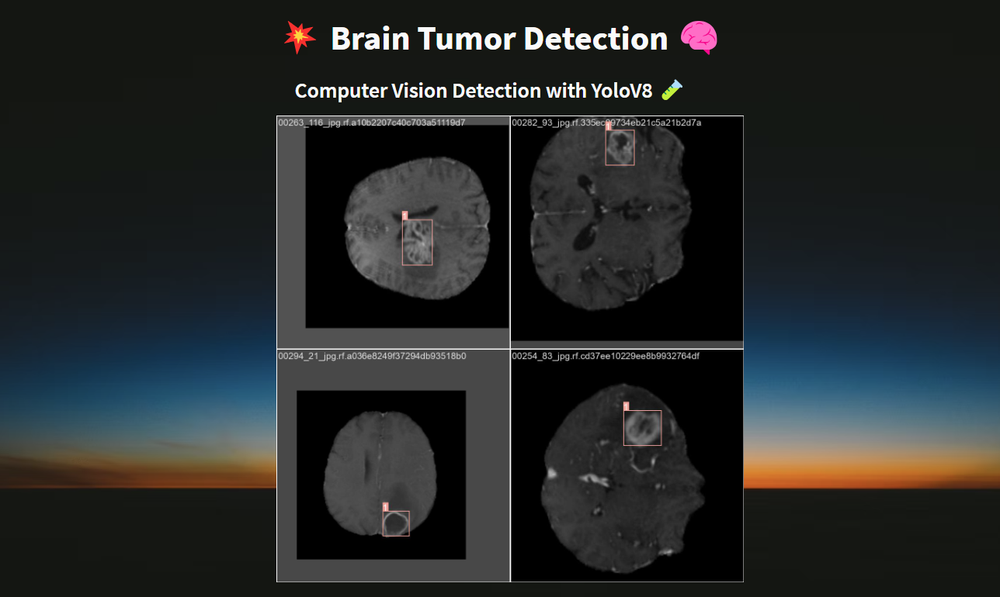
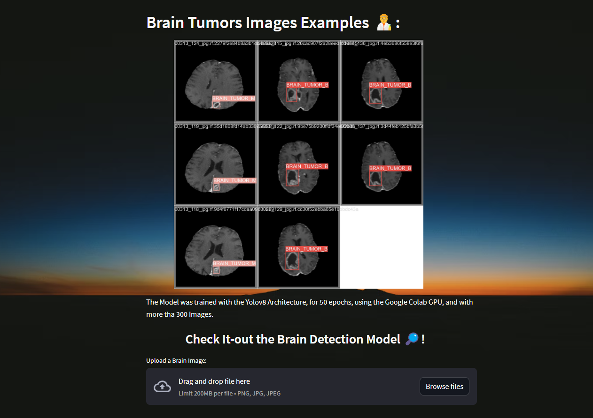
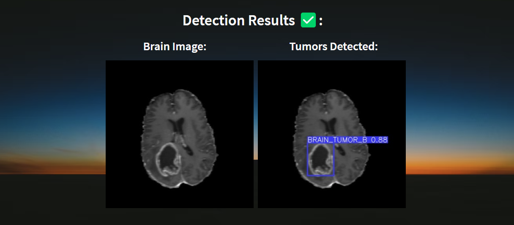

# Brain Tumor Detection 🧠


## Brain Tumor Detection with Python and YoloV8 

The Brain Tumor Detection was trained with over 600 Tumor Images, and with `YOLOv8`.



## Check-it out
Test it by running the `app.py` file, built with `Streamlit`.



## Run
```sh
streamlit run app.py
```



## Resources
- Brain Tumors Dataset: https://universe.roboflow.com/tfg-2nmge/axial-dataset
